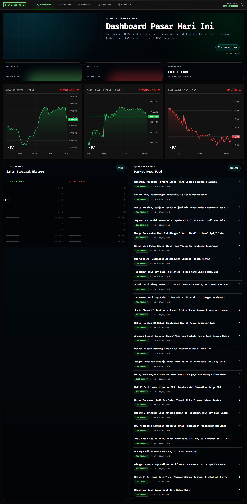
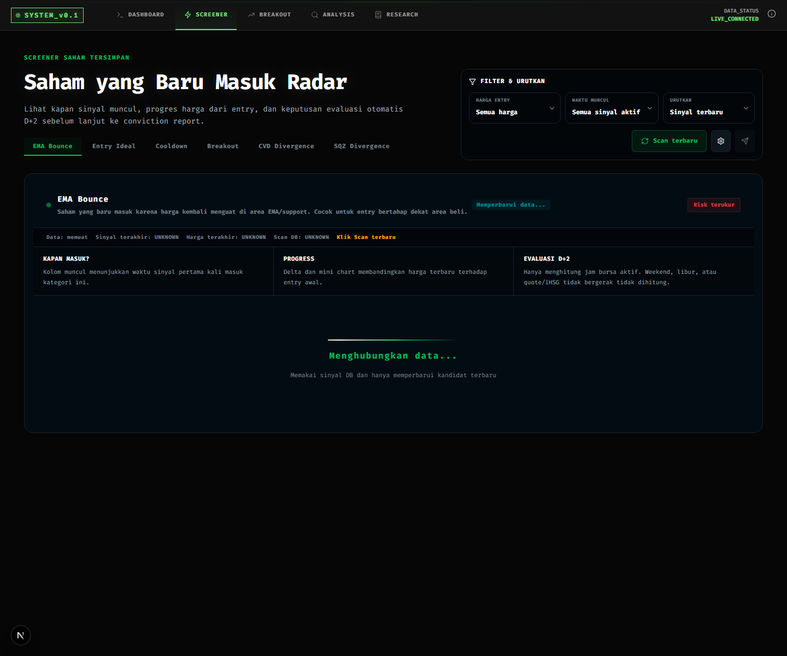
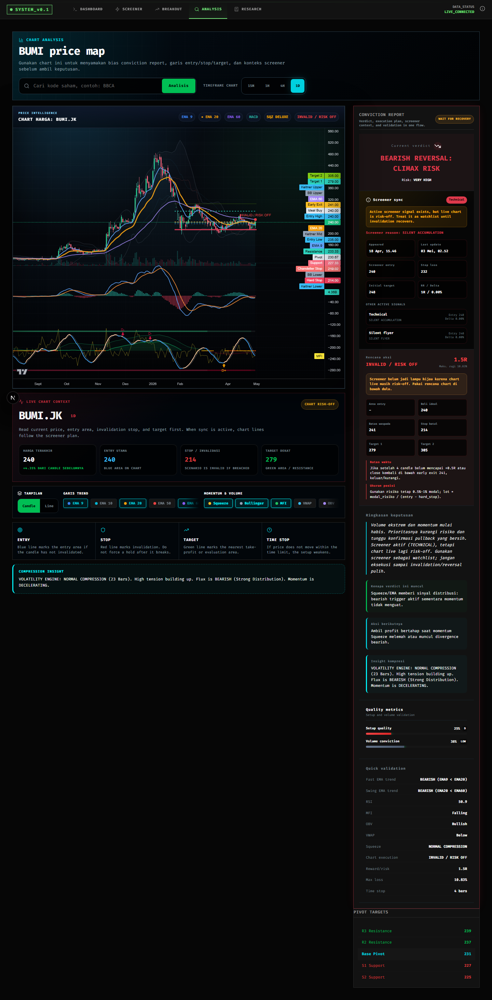
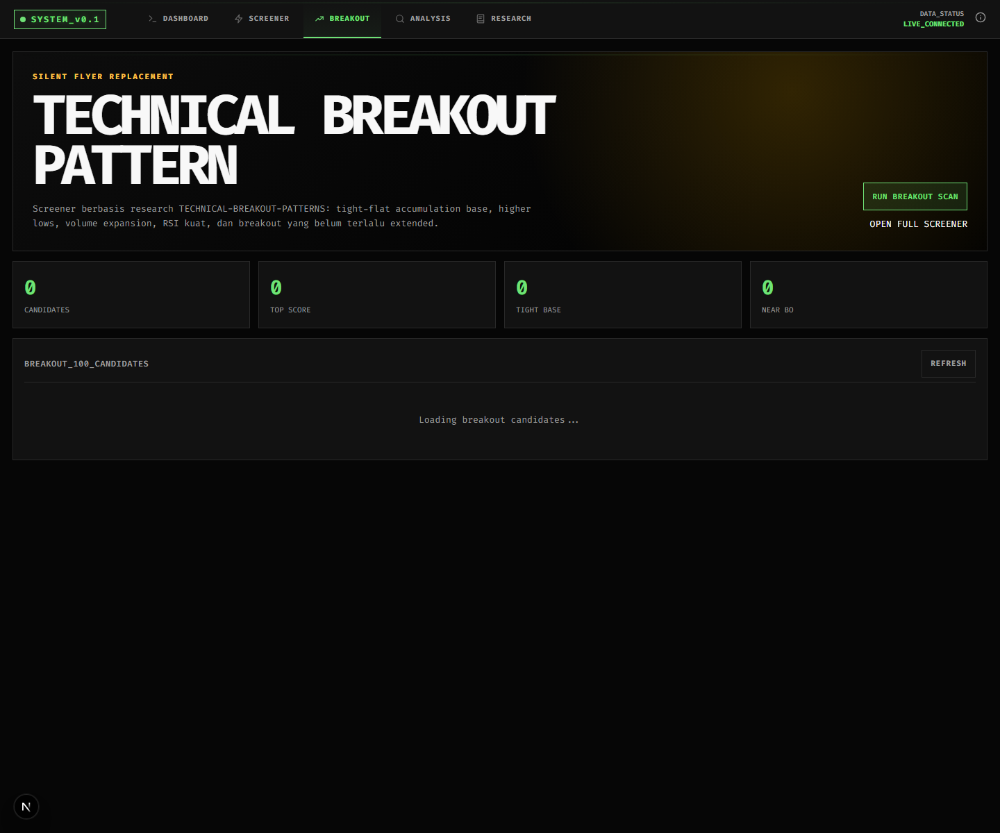
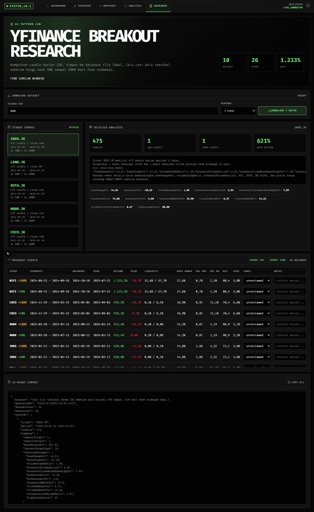

# Panduan Ultimate Screener

Panduan ini dibuat buat kamu yang mau pakai web ini dari nol: mulai dari lihat kondisi market, cari saham yang baru masuk radar, baca chart, sampai pakai conviction report dan Telegram bot.

> Catatan cepat: web ini adalah alat bantu riset, bukan ajakan beli/jual. Tetap pakai risk management sendiri.

## Isi Panduan

- [Alur Pakai Paling Simpel](#alur-pakai-paling-simpel)
- [Dashboard](#dashboard)
- [Screener](#screener)
- [Analysis / Chart](#analysis--chart)
- [Conviction Report](#conviction-report)
- [Breakout](#breakout)
- [Research](#research)
- [Settings](#settings)
- [Telegram Bot](#telegram-bot)
- [Cara Baca Sinyal dan Risk](#cara-baca-sinyal-dan-risk)
- [Workflow Harian](#workflow-harian)
- [FAQ Singkat](#faq-singkat)

## Alur Pakai Paling Simpel

Kalau baru buka web ini, jangan langsung loncat ke entry. Pakai urutan ini:

1. Buka `Dashboard` untuk lihat market lagi sehat atau lagi rawan.
2. Buka `Screener` untuk lihat saham yang baru masuk radar.
3. Klik `Report` di saham yang menarik.
4. Di halaman `Analysis`, cek chart dan conviction report.
5. Kalau report dan chart searah, baru pertimbangkan plan.
6. Kalau screener aktif tapi chart bilang risk-off, jangan paksa entry.
7. Catat area `entry`, `stop`, `target`, dan batas waktu skenario.

## Dashboard

Dashboard adalah halaman pembuka buat baca kondisi pasar secara cepat.



Yang perlu dilihat:

1. `Top gainer` dan `Top loser`.
2. Chart IHSG, Nikkei, dan VIX.
3. Panel `IDX Movers` untuk saham yang geraknya ekstrem.
4. Panel berita dari CNN Indonesia dan CNBC Indonesia.

Cara pakai:

1. Klik `Refresh semua` kalau mau data terbaru.
2. Lihat dulu apakah IHSG lagi kuat, sideways, atau tertekan.
3. Kalau banyak loser besar dan VIX naik, mode kamu sebaiknya lebih defensif.
4. Kalau market sehat, baru lanjut ke `Screener`.

Tips:

- Jangan hanya lihat top gainer. Kadang saham sudah terlalu jauh naik dan risk-nya besar.
- Kalau berita besar sedang ramai, tunggu chart konfirmasi dulu.

## Screener

Screener adalah halaman utama untuk cari saham yang baru masuk radar.



Di sini kamu akan lihat beberapa kategori sinyal, seperti:

- `Cooldown reset`
- `EMA bounce`
- `Buy on dip`
- `Squeeze`
- `Technical breakout`
- `Arahunter`
- `Turnaround`

Kolom penting:

1. `Ticker`: kode saham.
2. `Kategori / Vector`: alasan saham masuk radar.
3. `Muncul`: kapan sinyal pertama kali muncul.
4. `Entry`: area beli dari sistem.
5. `Target`: target awal.
6. `Stop`: area batal.
7. `Delta`: progres harga dari entry awal.
8. `Mini chart`: gambaran cepat arah harga setelah sinyal muncul.
9. `Chart / Report`: tombol untuk buka analysis lengkap.

Cara pakai step by step:

1. Pilih kategori sinyal yang mau dilihat.
2. Gunakan filter harga kalau kamu hanya mau saham di range tertentu.
3. Sort berdasarkan `latest` kalau mau sinyal paling baru.
4. Cek `Delta`: kalau sudah terlalu jauh, jangan FOMO.
5. Cek `D+2 evaluation`: sinyal yang gagal setelah 2 hari bursa aktif sebaiknya tidak dipaksa.
6. Klik `Report` untuk buka halaman Analysis.

Catatan D+2:

- D+2 hanya menghitung jam bursa aktif.
- Weekend, hari libur, atau quote yang tidak bergerak tidak dihitung.
- Jadi evaluasinya lebih adil dibanding hitung kalender biasa.

## Analysis / Chart

Halaman Analysis adalah tempat baca chart dan conviction report.



Cara buka:

1. Dari Screener, klik `Report`.
2. Atau buka menu `Analysis`, lalu ketik ticker seperti `BUMI`, `FIRE`, atau `DEWA`.
3. Kalau ticker IDX belum pakai `.JK`, sistem akan menambahkan otomatis.

Bagian penting di halaman ini:

1. Chart utama.
2. Ringkasan harga terakhir.
3. Entry utama.
4. Stop / invalidasi.
5. Target dekat.
6. Toggle indikator seperti EMA, Squeeze, Bollinger, MFI, VWAP, OBV, CMF.
7. Conviction Report di sisi kanan atau bawah pada mobile.

Cara baca chart:

1. Lihat trend besar dulu, jangan langsung lihat candle terakhir.
2. Cek apakah harga berada di atas atau bawah EMA penting.
3. Cek apakah harga masih dekat area entry atau sudah telat.
4. Cek garis stop. Kalau candle sudah tembus, skenario batal.
5. Cek target. Kalau jarak target kecil tapi stop jauh, risk/reward kurang menarik.

Di mobile:

- Chart tetap bisa dipakai, tapi label dibuat lebih pendek.
- Fokus dulu ke garis besar: entry, stop, target.
- Untuk detail lengkap, scroll ke bagian report.

## Conviction Report

Conviction Report adalah versi ringkas dari semua data teknikal yang sudah dirangkum jadi rencana.

Bagian yang perlu kamu baca berurutan:

1. `Current verdict`: kesimpulan utama.
2. `Risk`: level risiko.
3. `Screener sync`: apakah sinyal screener sinkron dengan chart.
4. `Rencana aksi`: area entry, stop, target, RR, dan batas waktu.
5. `Ringkasan keputusan`: alasan singkat kondisi sekarang.
6. `Kenapa verdict ini muncul`: alasan teknikal utama.
7. `Aksi berikutnya`: apa yang sebaiknya dilakukan.
8. `Insight kompresi`: info Squeeze / volatility engine.
9. `Quality metrics`: skor setup dan volume.
10. `Quick validation`: validasi indikator penting.

Contoh cara baca `Rencana aksi`:

```text
Rencana aksi
INVALID / RISK OFF
1.5R
Maks. rugi 7.74%

Area entry    : -
Beli ideal    : 7.379
Batas waspada : 7.321
Stop batal    : 6.808
Target 1      : 8.236
Target 2      : 8.807
```

Artinya:

1. Status `INVALID / RISK OFF` berarti jangan agresif dulu.
2. `1.5R` adalah estimasi reward/risk.
3. `Maks. rugi` adalah jarak risiko dari entry ke stop.
4. `Beli ideal` adalah area terbaik menurut sistem.
5. `Batas waspada` adalah level awal untuk mulai hati-hati.
6. `Stop batal` adalah level yang membatalkan skenario.
7. `Target 1` dan `Target 2` adalah area take profit bertahap.

Kalau `Screener sync` bilang aktif tapi chart risk-off:

1. Masukkan saham ke watchlist.
2. Jangan entry dulu.
3. Tunggu chart pulih atau candle kembali valid.
4. Baru pakai entry/stop/target setelah tidak invalid.

Kalau `Screener sync` dan chart searah:

1. Pakai entry, stop, dan target yang sama dengan report.
2. Jangan ubah stop lebih jauh hanya karena harga turun.
3. Kalau sudah dekat target, evaluasi atau take profit bertahap.

## Breakout

Halaman `Breakout` fokus ke kandidat technical breakout.



Gunanya:

- Cari saham dengan base ketat.
- Cari higher low.
- Cari volume expansion.
- Cari breakout yang belum terlalu extended.

Cara pakai:

1. Buka menu `BREAKOUT`.
2. Klik `RUN BREAKOUT SCAN` kalau mau scan ulang.
3. Lihat kandidat dengan score tertinggi.
4. Cek `Entry`, `Target`, `Stop`, `Base`, `Dist BO`, `Vol`, dan `RSI`.
5. Klik `ANALYZE` untuk buka chart dan conviction report.

Tips:

- Breakout bagus biasanya tidak terlalu jauh dari base.
- Kalau `Dist BO` sudah tinggi, risk mengejar harga juga lebih tinggi.

## Research

Research dipakai untuk membangun corpus pola saham yang pernah naik besar.



Gunanya:

- Download data historis Yahoo Finance.
- Cari event saham yang naik 50% sampai 100%.
- Simpan pola dan fitur teknikalnya.
- Label event manual sebagai winner, failed breakout, false breakout, watchlist, dan lain-lain.

Cara pakai:

1. Buka menu `RESEARCH`.
2. Masukkan ticker, misalnya `BUMI`.
3. Pilih periode 1, 2, 3, atau 5 tahun.
4. Klik `DOWNLOAD / ENTER`.
5. Pilih dataset yang sudah tersimpan.
6. Baca summary dan event breakout.
7. Beri label event kalau perlu.
8. Export CSV/JSON kalau mau dianalisis lebih lanjut.

## Similar Winners

Halaman ini ada di `/research/similar`.

Gunanya:

- Mencari saham yang mirip dengan historical winners.
- Ranking kandidat berdasarkan kemiripan pola.
- Melihat apakah setup masih early, near breakout, breakout, atau sudah extended.

Cara pakai:

1. Buka `Research`.
2. Klik `FIND SIMILAR WINNERS`.
3. Tentukan limit saham yang mau discan.
4. Pilih periode.
5. Klik `FIND SIMILAR WINNERS`.
6. Baca ranking kandidat.
7. Jangan langsung entry. Buka chart dulu untuk validasi.

## Settings

Settings dipakai untuk mengatur bot Telegram.

Yang bisa diisi:

1. `BOT_API_TOKEN`: token bot dari BotFather.
2. `CHANNEL_OR_GROUP_ID`: ID channel atau group Telegram.
3. `VOLUME_SPIKE_THRESHOLD`: batas rasio volume untuk alert.
4. `ENABLE_REALTIME_ALERTS`: aktif/nonaktifkan alert real-time.

Cara setup singkat:

1. Buat bot lewat BotFather di Telegram.
2. Copy token bot.
3. Masukkan token ke `BOT_API_TOKEN`.
4. Tambahkan bot ke channel/group sebagai admin.
5. Masukkan ID channel/group.
6. Atur threshold volume sesuai kebutuhan.
7. Centang `ENABLE_REALTIME_ALERTS` kalau mau alert jalan.
8. Klik `SAVE_CONFIGURATION`.

Kalau bot tidak merespons:

1. Pastikan token benar.
2. Pastikan bot sudah jadi admin di channel/group.
3. Pastikan `CHANNEL_OR_GROUP_ID` benar.
4. Pastikan proses `scripts/telegram_bot.js` sedang berjalan di server.

## Telegram Bot

Bot Telegram dibuat supaya kamu bisa minta analisis cepat tanpa buka web.

Command penting:

```text
BUMI
FIRE
DEWA
FIRE BUMI DEWA
BUMI scalp
/chart BUMI
/analysis BUMI
/analysis BUMI scalp
/daytrade
/scalp
/arahunter
/top
```

Cara pakai ticker langsung:

1. Ketik `BUMI` untuk analisis harian.
2. Ketik `BUMI scalp` untuk timeframe 15 menit.
3. Ketik `FIRE BUMI DEWA` untuk minta beberapa report sekaligus.

Output Telegram sudah disamakan dengan web:

- `verdict` berasal dari `/api/technical` yang sama.
- `screener sync` berasal dari sinyal aktif yang sama.
- `Rencana aksi`, `Ringkasan keputusan`, `Kenapa verdict ini muncul`, `Aksi berikutnya`, dan `Insight kompresi` dibuat searah dengan conviction report web.

Kalau Telegram dan web terlihat beda:

1. Klik tombol `Refresh` di Telegram.
2. Buka tombol `View Interactive Chart`.
3. Pastikan timeframe sama, misalnya `1d` vs `15m`.
4. Kalau tetap beda, kemungkinan data quote baru masuk di salah satu sisi lebih dulu.

## Cara Baca Sinyal dan Risk

Gunakan aturan sederhana ini:

### Sinyal Bagus

- Chart tidak risk-off.
- Harga belum jauh dari entry.
- Stop jelas.
- Target masih masuk akal.
- Volume mendukung.
- Screener dan chart searah.

### Sinyal Perlu Ditunggu

- Screener aktif tapi chart risk-off.
- Harga sudah terlalu jauh dari entry.
- Reward/risk kecil.
- Volume melemah.
- Squeeze belum keluar arah.

### Sinyal Sebaiknya Dihindari

- Harga sudah tembus stop.
- Chart bearish reversal.
- Candle terakhir invalidasi setup.
- Delta sudah terlalu tinggi dan dekat target.
- Market utama sedang sangat lemah.

## Workflow Harian

### Sebelum Market Buka

1. Buka Dashboard.
2. Cek berita utama.
3. Cek kandidat screener dari hari sebelumnya.
4. Tandai saham yang masih dekat entry.
5. Abaikan yang sudah invalid atau terlalu jauh.

### Saat Market Berjalan

1. Gunakan Screener untuk sinyal baru.
2. Buka Report sebelum ambil keputusan.
3. Jangan entry kalau status risk-off.
4. Gunakan stop sesuai report.
5. Kalau harga bergerak cepat, tunggu pullback daripada kejar candle.

### Setelah Market Tutup

1. Evaluasi sinyal yang masuk D+2.
2. Cek mana yang lanjut dan mana yang gagal.
3. Update watchlist.
4. Tambahkan data Research kalau ada saham menarik.

## FAQ Singkat

### Kenapa default Analysis buka IHSG?

Supaya saat halaman dibuka langsung ada chart yang berguna. IHSG jadi konteks market utama sebelum lihat saham individu.

### Kenapa chart tampil 1 tahun tapi bisa scroll ke kiri?

Data harian diambil sampai beberapa tahun, tapi viewport awal dibuat 1 tahun supaya chart tidak terlalu padat.

### Kenapa D+2 tidak menghitung weekend?

Karena harga tidak bergerak di weekend/libur. Evaluasi memakai jam bursa aktif supaya lebih adil.

### Apa beda Screener dan Conviction Report?

Screener mencari kandidat. Conviction Report memvalidasi apakah kandidat itu layak dieksekusi sekarang atau cukup masuk watchlist.

### Kalau screener aktif tapi report risk-off, ikut yang mana?

Ikut report. Artinya saham masuk radar, tapi chart live belum aman untuk entry.

### Kalau Telegram dan web beda?

Pastikan timeframe sama dan refresh ulang. Keduanya memakai endpoint analisis yang sama, tapi timing quote bisa berbeda beberapa saat.

## Checklist Sebelum Entry

Pakai checklist ini sebelum menekan tombol beli:

- Apakah chart tidak risk-off?
- Apakah harga masih dekat area entry?
- Apakah stop jelas?
- Apakah target memberi reward/risk masuk akal?
- Apakah candle terakhir belum invalidasi?
- Apakah market umum mendukung?
- Apakah kamu siap cut loss kalau stop ditembus?

Kalau ada dua atau lebih jawaban “tidak”, lebih baik tunggu.
